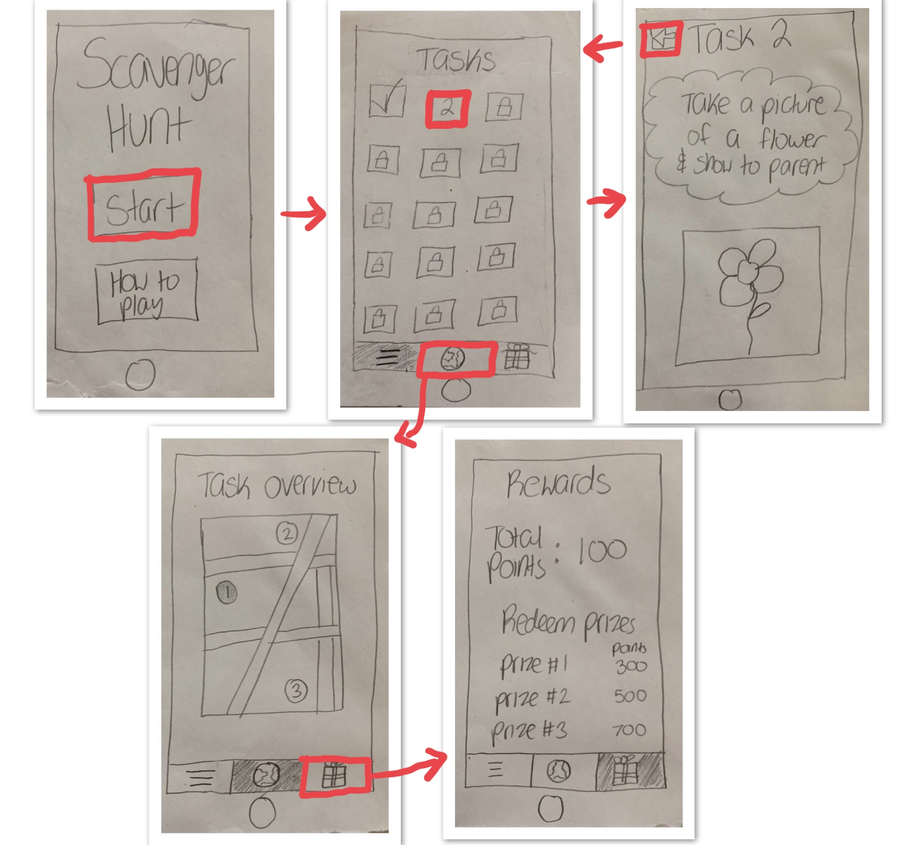

Team Name: Goal Diggers

Team Members: Emi Oda, Matthias Baker, Natalia Ratosh, Kristen Randall

Team's project idea:
Our idea for the team project is a scavenger hunt type of game for kids, to motivate them to go outside and adventure in the real world, rather than a virtual world. We feel children in this generation are so connected and attached to their technological devices such as phones and tablets, that they never tend to just step outside and enjoy nature. Our app will give kids tasks to complete outside and get rewarded points based on how many they complete. In order to ensure children’s safety while playing the game, parents will also be required to complete certain tasks with their children, also giving them a chance to bond. The app’s target population is kids under the age of 10. This fits the project theme because it’s targeted towards a population that is different from us. We are not part of the user population as we are adults. We want to use Google Maps API in order to integrate a real map as a feature of the app. 

Storyboard 1:

Storyboard 2:

Prototype 1:

Prototype 2:

