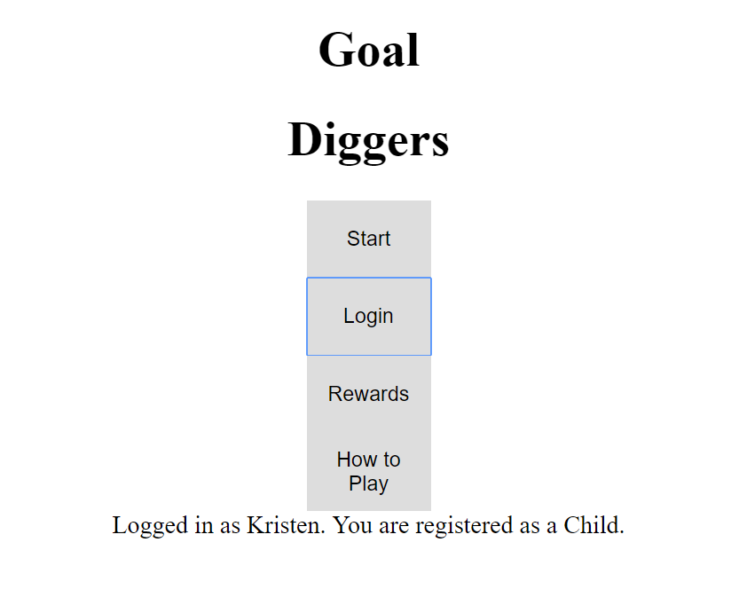
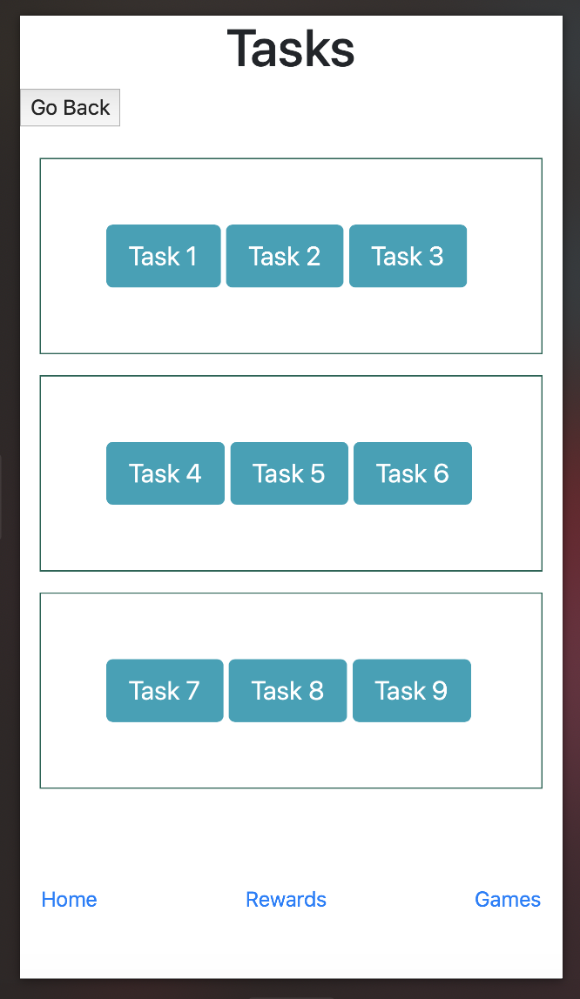
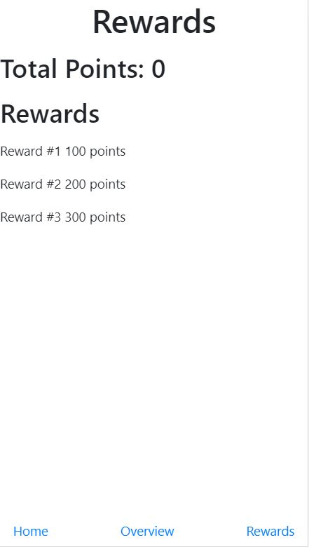

We received great feedback from our TA on our idea for our app so we decided to go forward with it. The idea of our app is the same as what we proposed in Milestone 1. Just to recap, however, our proposed idea for our app is a scavenger hunt type game designed mainly for kids with the intended purpose for them to go out and explore nature more rather than always being inside on various technological devices. Our app would use technology to promote a more natural lifestyle while also allowing children and their parents to play the game and explore together.

UI skeletons:

Home Page

Tasks Page

Rewards Page

Our pages correspond to paper prototype2.jpg from Milestone 1. 

Read data we are going to use: ??

