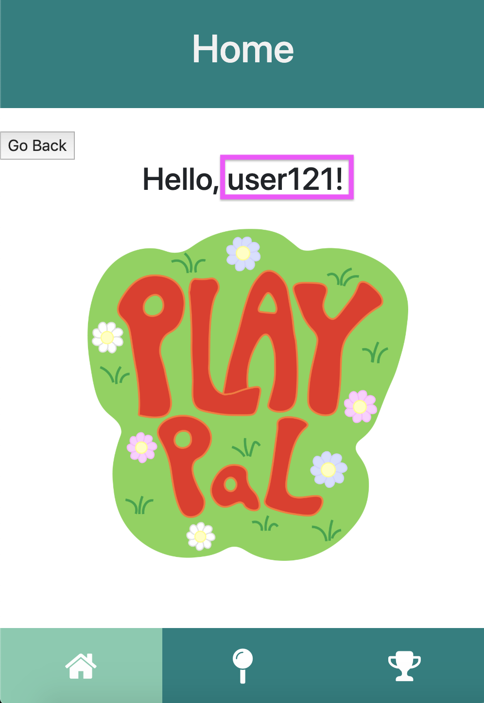
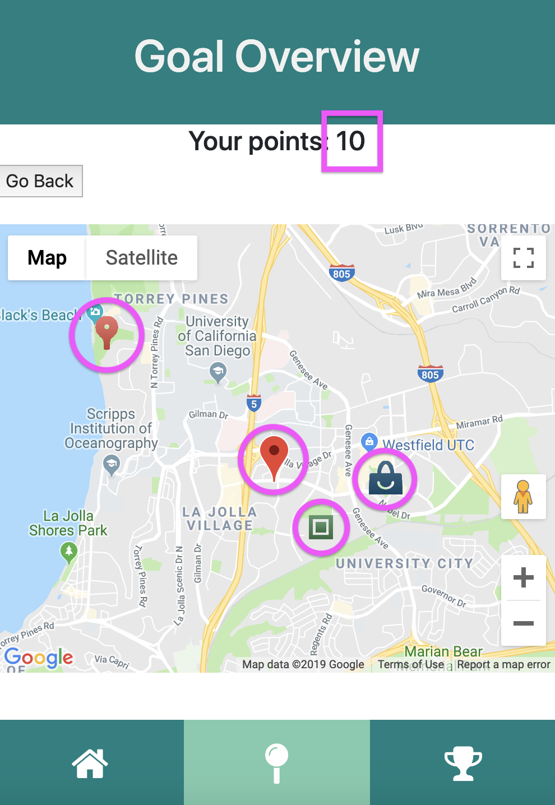

paragraph describing how someone in your target user population would use your app in order to help them achieve relevant goals. Think of this as a storyboard (setting+sequence+satisfaction) except written in a paragraph instead of using drawings.

Our app was designed for children, mainly under the age of 10, to be able to explore the world with their parents and use technology to complete different goals in the real world, rather than just virtually in an app. For example, we have a seven year old child Nick. Nick's mom is concerned that he is too addicted to technology and the ipad so she wants to find a way to combine his love for technology with a desire to want to play and adventure outdoors. She finds and installs Play Pal on the ipad, an interactive game where she can promote exploration around the neighborhood. She then lets Nick login to the app and choose where he wants to explore first. Nick chooses to go to the beach. So his mom drives them both to the beach and they complete the three tasks together, earning points for completing each task. If Nick and his mom are feeling more adventurous, they could venture to the nearby park and complete the tasks there too. Once all the tasks are completed, both Nick and his mom are satisfied with a fun-filled day full of different adventures they were able to explore together. Nick had fun and his mom was able to teach Nick about the amazing things one can find in nature, with the assistance of the technology, but not making it the sole focus. 

screenshots of your latest UI webpages 

Sign-up/login Page

Home page

Map Overview

Goal 1

Camera Function

Goal Complete

Goal 2

Goal 3

Goal 4

Goal 5

Goal 6

Goal 7

Goal 8

Goal 9

Rewards

This week we were able to finish the rest of the goals for the 3 different locations (mall, park, and beach). We also updated the start page to include a sign up feature rather than just the simple login so users can create a new account if they do not have one yet. Besides park,we added beach and mall locations that include new goals. We also updated the styling on the rewards page and included some actual rewards that users can redeem their points for within the app. We created a new homepage where it takes in the current user on the app and says "Hello", as well as a logout button on that page. Finally, we added "Your points:" at the top of the task overview page with the map so that the user can see their current points when looking at goals they can complete.
 
Display of Data
 
Once a user sign up, the name, password and number of points are posted into database. On home page user name is displayed. On the goal overview page we have total points displayed. We also have a pin on the current user location and 3 different locations nearby retrieved using Google API.

Home

Goal Overview

Implemented API

We hooked up to the google maps API to be able to find and display the different locations within our app. We also use a database to store the amount of points accumulated by the user every time they complete a task and display these points on the rewards page.

paragraph describing some more ambitious data display or visualization ideas beyond what you've implemented that would make your app more polished
  
  
